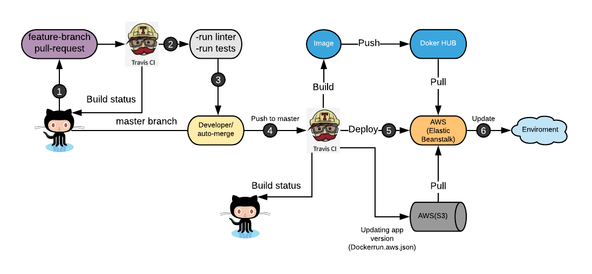

# PDP CI/CD Microservices  [](https://travis-ci.com/martmax/pdp-ci-cd)

## CI/СD
### TravisCI
Config file: [.travis.yml](.travis.yml)

###Pipeline



**Process**

1. Create feature branch from master:
    - make changes in some app
    - commit changes and push to repository
    - create pull request
2. When pull request is created Travis-CI triggers two jobs in parallel with corresponding app.:
    - checked what application commits changes is affected [check-target-changes.sh](devops/scripts/check-target-changes.sh):
        - lint component via [ci.run-target.lint.sh](devops/scripts/ci.run-target.lint.sh)
        - unit test component via [ci.run-target.test.sh](devops/scripts/ci.run-target.test.sh)

3. If all jobs successfully passed TRAVIS notify github and we are able to merge branch into master.
4. Feature branch pushed to master.    
5. When feature branch pushed to master Travis-CI trigger deploy scripts (2 jobs):
    - checked what application commits changes is affected [check-target-changes.sh](devops/scripts/check-target-changes.sh):
        - trigger deploy job via [ci.eb-deploy-target.sh](devops/scripts/ci.eb-deploy-target.sh) 
        - inject all variables stored in Travis-CI dashboard
        - start building image for corresponding app via [ci.build-target.docker-hub.sh](devops/scripts/ci.build-target.docker-hub.sh)
            - tag images with :latest and :TRAVIS_BUILD_NUMBER tag
            - push those images to $DOCKER_HUB_USERNAME/$TARGET
        - copy Dockerrun.aws.json  with new version(TRAVIS_BUILD_NUMBER) to AWS S3 bucket       
6. AWS Elastic Beanstalk:
    - pull image from Docker HUB
    - pull new version of Dockerrun.aws.json from AWS S3
    - update environment


**Travis CI configuration**

	1. We have to set `Build pushed branches` option to `ON` ([documentation](https://docs.travis-ci.com/user/web-ui/#build-pushed-branches))
	2. We have to set `Build pushed pull requests` option to `ON` ([documentation](https://docs.travis-ci.com/user/web-ui/#build-pushed-pull-requests))

**Travis CI ENV variables**	

*name* | *evs*  | documentation | short description
--- | --- | --- | ---
Docker hub | `DOCKER_HUB_PASSWORD`, `DOCKER_HUB_USERNAME` | [link](https://hub.docker.com/) | sign in credentials to docker hub
Github | `GITHUB_SECRET_TOKEN` | [link](https://github.com/settings/tokens) | have to generate token for repository access
Heroku | `HEROKU_API_KEY`, `HEROKU_CREDENTIALS_EMAIL`, `HEROKU_CREDENTIALS_PASSWORD` | [link](https://devcenter.heroku.com/articles/authentication) | should generate an API key that allows me to use the Heroku API
AWS | `AWS_ACCESS_KEY_ID`, `AWS_SECRET_ACCESS_KEY`, `AWS_DEFAULT_REGION` | [link](https://docs.aws.amazon.com/IAM/latest/UserGuide/id_users_create.html) | should create iam user with admin polices and `Access Key ID`, `Secret Access Key`


### CI scripts
All CI scripts located at  `devops/scripts` folder: 

- **``` $ ./auto_merge.sh ```** - automatically merged PR to master after all jobs pass successfully
- **``` $ ./check-target-changes.sh ```** - check if some project was changed or not (take one argument `${project name}`)
- **``` $ ./ci.build-target.docker-hub.sh ```** - build and push current project to `Docker hub` (take one argument `${project name}`)
- **``` $ ./ci.eb-deploy-target.sh ```** - deploy current project to AWS Elastic BeanStalk (take one argument `${project name}`)
- **``` $ ./ci.heroku-deploy-target.sh ```** - push and deploy current project to Heroku (take one argument `${project name}`)
- **``` $ ./ci.build-target.ecr.sh ```** - build and push current project to `AWS ECR` (take one argument `${project name}`)
- **``` $ ./ci.run-target.lint.sh ```** - run linter for current project (take one argument `${project name}`)
- **``` $ ./ci.run-target.test.sh ```** - run tests for current project (take one argument `${project name}`)
	

## Contribution
Before push commit make sure that all modules are added in package.json

### development flow

**SubTask*** is Open

	1. Move Jira ticket to ***in progress*** status _(ex. SJ-587)_;
	2. Shortly discuss with the UX specialist story wireframes;
	3. Shortly discuss with me or another colleagues about implementation;
	4. Create feature branch **`feature/${projectKey}-${ticketNumber}`**  _(ex. **feature/SJ-531**)_ from **master**

**SubTask*** is done on your local branch

	0. Pull actual state of **master** branch;
	1. Check test cases from TestRails;
	2. Check functionality and interface behavior with UX specialist;
	3. Create merge request on **master** branch;
	4. Move Jira ticket to ***code review*** status;
	5. Wait for **code review process**** from colleagues;
	6. Resolve review and accept merge request.

**SubTask*** is on *master branch* and deploed on *develop environment*

	1. Move Jira ticket to ***done*** status;

in case when **SubTask** is the last development ticket in the Story.

	1. Move Story to **ready to test** status and reassign to QA engineer which assigned to `[QA]` subTask.

`*`: It is sub task of main Jira Story which marked by `[FE]` prefix;

`**`: **Code review process**

Code review process:

	1. Opened merge it is **high priority** for another **developers**
	2. Review code of your colleague
	3. Send comment if you have
	4. Leave 'Like' on merge request, if your comments resolves or you do not have any questions
	5. After 2 'Likes' from colleagues, you can accept merge request.


### git branching strategy - (Trunk based development)


